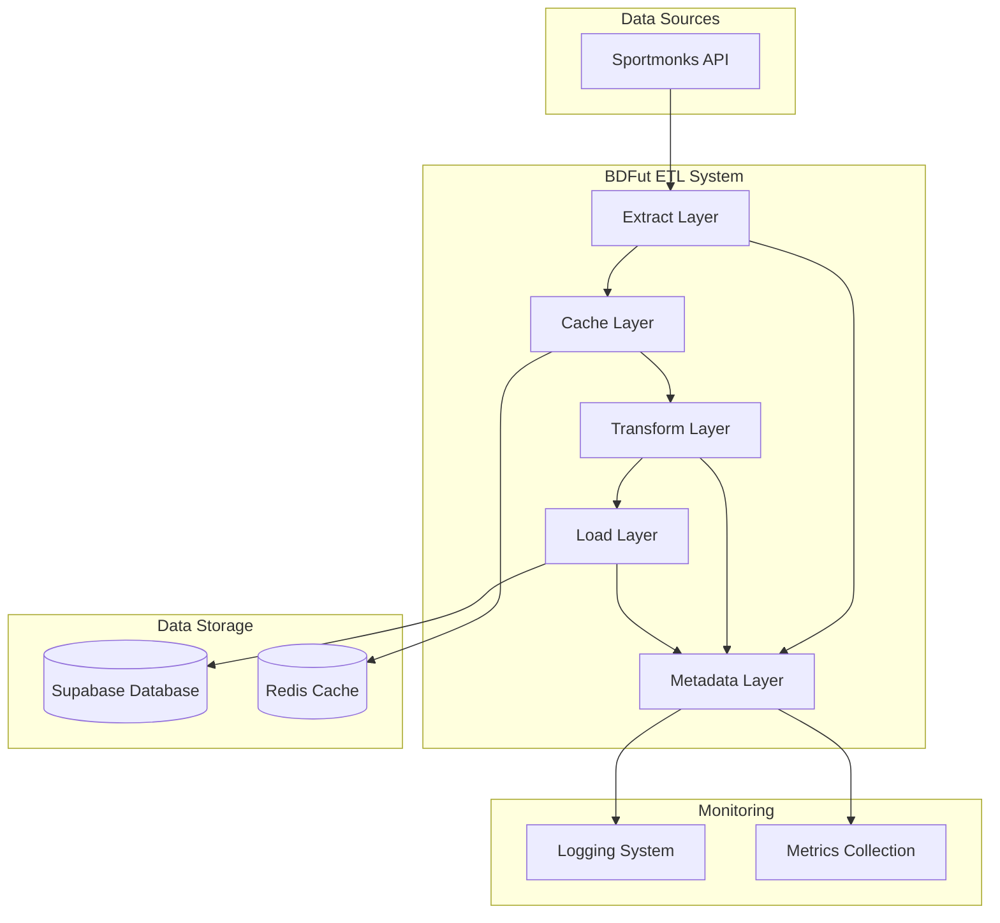
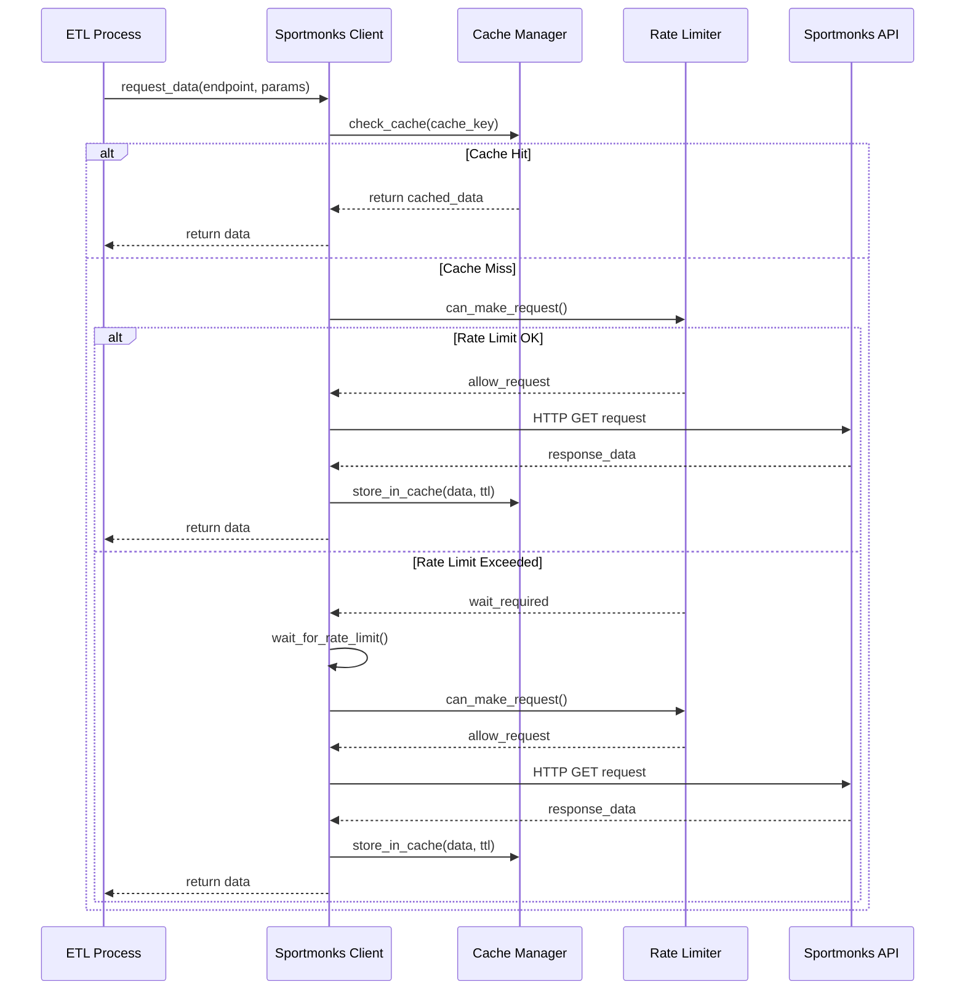
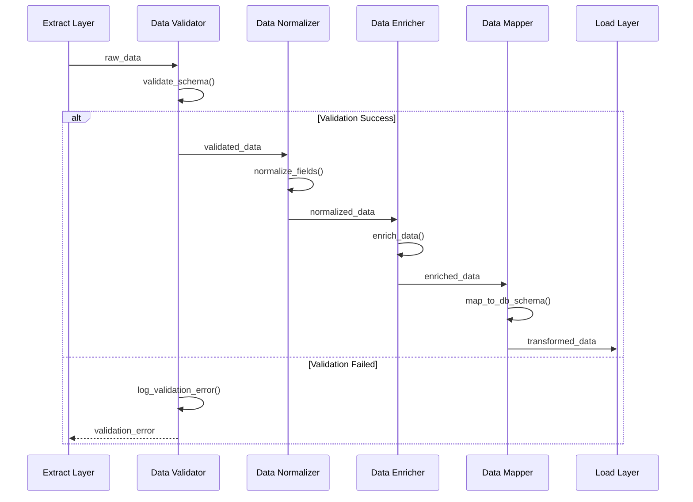
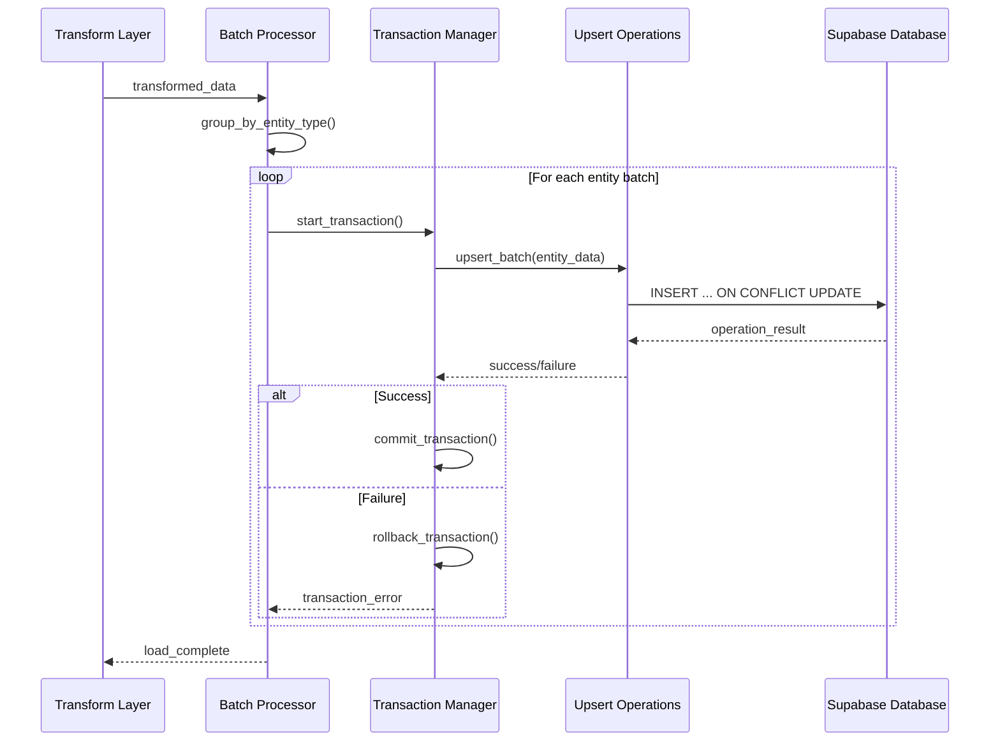
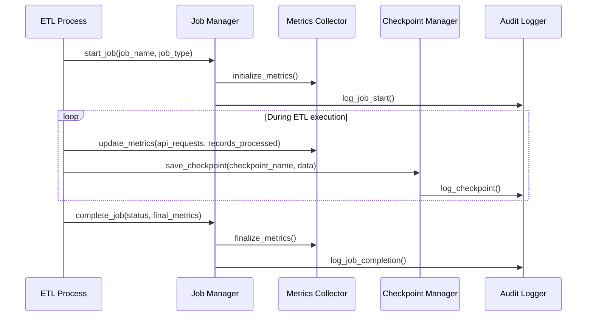

# Fluxo de Dados ETL - BDFut 🔄

## Visão Geral

Este documento detalha o fluxo completo de dados no sistema BDFut, desde a extração da API Sportmonks até o armazenamento no Supabase, incluindo transformações, validações e otimizações.

## Diagrama de Fluxo Geral



## Camadas do ETL

### 1. Extract Layer (Camada de Extração)

**Responsabilidade**: Extrair dados da API Sportmonks de forma eficiente e respeitando rate limits.

#### Componentes Principais
- **SportmonksClient**: Cliente HTTP para API
- **RateLimiter**: Controle de requisições
- **CacheManager**: Cache inteligente
- **RetryHandler**: Retry automático

#### Fluxo de Extração



#### Tipos de Extração

**1. Dados Base (Countries, States, Types)**
```python
def extract_base_data():
    """Extrai dados base que mudam raramente"""
    countries = sportmonks_client.get_countries()
    states = sportmonks_client.get_states()
    types = sportmonks_client.get_types()
    return {
        'countries': countries,
        'states': states,
        'types': types
    }
```

**2. Ligas e Temporadas**
```python
def extract_leagues_and_seasons(league_ids):
    """Extrai ligas e suas temporadas"""
    leagues_data = []
    seasons_data = []
    
    for league_id in league_ids:
        league = sportmonks_client.get_league_by_id(
            league_id, 
            include='seasons'
        )
        if league:
            leagues_data.append(league)
            if 'seasons' in league:
                seasons_data.extend(league['seasons'])
    
    return {
        'leagues': leagues_data,
        'seasons': seasons_data
    }
```

**3. Times por Temporada**
```python
def extract_teams_by_season(season_id):
    """Extrai times de uma temporada específica"""
    teams = sportmonks_client.get_teams_by_season(
        season_id,
        include='venue'
    )
    
    venues = []
    for team in teams:
        if 'venue' in team and team['venue']:
            venues.append(team['venue'])
    
    return {
        'teams': teams,
        'venues': venues
    }
```

**4. Partidas por Intervalo de Datas**
```python
def extract_fixtures_by_date_range(start_date, end_date, include_details=False):
    """Extrai partidas em um intervalo de datas"""
    includes = 'participants;state;venue'
    if include_details:
        includes += ';events;statistics;lineups;referees'
    
    fixtures = sportmonks_client.get_fixtures_by_date_range(
        start_date, end_date, include=includes
    )
    
    # Extrair entidades relacionadas
    venues = []
    referees = []
    participants = []
    events = []
    
    for fixture in fixtures:
        if 'venue' in fixture and fixture['venue']:
            venues.append(fixture['venue'])
        
        if 'referees' in fixture and fixture['referees']:
            referees.extend(fixture['referees'])
        
        if 'participants' in fixture:
            participants.extend(fixture['participants'])
        
        if 'events' in fixture and fixture['events']:
            events.extend(fixture['events'])
    
    return {
        'fixtures': fixtures,
        'venues': venues,
        'referees': referees,
        'participants': participants,
        'events': events
    }
```

### 2. Transform Layer (Camada de Transformação)

**Responsabilidade**: Transformar dados da API para o formato do banco de dados, incluindo validação e normalização.

#### Componentes Principais
- **DataValidator**: Validação de dados
- **DataNormalizer**: Normalização de dados
- **DataEnricher**: Enriquecimento de dados
- **DataMapper**: Mapeamento de campos

#### Fluxo de Transformação



#### Transformações por Tipo de Dados

**1. Países (Countries)**
```python
def transform_country_data(country):
    """Transforma dados de país da API para schema do banco"""
    return {
        'id': country.get('id'),
        'name': country.get('name'),
        'official_name': country.get('official_name'),
        'fifa_name': country.get('fifa_name'),
        'iso2': country.get('iso2'),
        'iso3': country.get('iso3'),
        'latitude': float(country.get('latitude', 0)) if country.get('latitude') else None,
        'longitude': float(country.get('longitude', 0)) if country.get('longitude') else None,
        'borders': json.dumps(country.get('borders', [])),
        'image_path': country.get('image_path'),
        'updated_at': datetime.now().isoformat()
    }
```

**2. Ligas (Leagues)**
```python
def transform_league_data(league):
    """Transforma dados de liga da API para schema do banco"""
    return {
        'id': league.get('id'),
        'name': league.get('name'),
        'short_code': league.get('short_code'),
        'image_path': league.get('image_path'),
        'type': league.get('type'),
        'sub_type': league.get('sub_type'),
        'last_played_at': league.get('last_played_at'),
        'category': league.get('category'),
        'has_jerseys': league.get('has_jerseys', False),
        'updated_at': datetime.now().isoformat()
    }
```

**3. Partidas (Fixtures)**
```python
def transform_fixture_data(fixture):
    """Transforma dados de partida da API para schema do banco"""
    return {
        'id': fixture.get('id'),
        'name': fixture.get('name'),
        'starting_at': fixture.get('starting_at'),
        'result_info': fixture.get('result_info'),
        'leg': fixture.get('leg'),
        'details': fixture.get('details'),
        'length': fixture.get('length'),
        'placeholder': fixture.get('placeholder', False),
        'has_odds': fixture.get('has_odds', False),
        'has_players': fixture.get('has_players', False),
        'has_tables': fixture.get('has_tables', False),
        'has_lineups': fixture.get('has_lineups', False),
        'has_stats': fixture.get('has_stats', False),
        'has_events': fixture.get('has_events', False),
        'has_league': fixture.get('has_league', False),
        'has_venue': fixture.get('has_venue', False),
        'has_referee': fixture.get('has_referee', False),
        'sport_id': fixture.get('sport_id'),
        'league_id': fixture.get('league_id'),
        'season_id': fixture.get('season_id'),
        'stage_id': fixture.get('stage_id'),
        'group_id': fixture.get('group_id'),
        'aggregate_id': fixture.get('aggregate_id'),
        'round_id': fixture.get('round_id'),
        'state_id': fixture.get('state_id'),
        'venue_id': fixture.get('venue_id'),
        'referee_id': fixture.get('referee_id'),
        'updated_at': datetime.now().isoformat()
    }
```

#### Validações Implementadas

**1. Validação de Schema**
```python
def validate_country_schema(country):
    """Valida schema de dados de país"""
    required_fields = ['id', 'name']
    for field in required_fields:
        if field not in country:
            raise ValueError(f"Campo obrigatório '{field}' ausente")
    
    # Validação de tipos
    if not isinstance(country['id'], int):
        raise ValueError("ID deve ser inteiro")
    
    if not isinstance(country['name'], str):
        raise ValueError("Nome deve ser string")
    
    return True
```

**2. Validação de Integridade**
```python
def validate_fixture_integrity(fixture):
    """Valida integridade de dados de partida"""
    # Verificar se tem participantes
    if 'participants' not in fixture:
        raise ValueError("Partida deve ter participantes")
    
    # Verificar se tem pelo menos 2 participantes
    if len(fixture['participants']) < 2:
        raise ValueError("Partida deve ter pelo menos 2 participantes")
    
    # Verificar se tem data válida
    if not fixture.get('starting_at'):
        raise ValueError("Partida deve ter data de início")
    
    return True
```

### 3. Load Layer (Camada de Carregamento)

**Responsabilidade**: Carregar dados transformados no banco Supabase de forma eficiente e consistente.

#### Componentes Principais
- **SupabaseClient**: Cliente do banco de dados
- **BatchProcessor**: Processamento em lotes
- **TransactionManager**: Gerenciamento de transações
- **ConflictResolver**: Resolução de conflitos

#### Fluxo de Carregamento



#### Operações de Carregamento

**1. Upsert de Países**
```python
def load_countries(countries_data):
    """Carrega países no banco de dados"""
    try:
        # Preparar dados para upsert
        data = [transform_country_data(country) for country in countries_data]
        
        # Executar upsert
        result = supabase_client.table('countries').upsert(
            data, 
            on_conflict='id'
        ).execute()
        
        logger.info(f"Carregados {len(data)} países")
        return True
        
    except Exception as e:
        logger.error(f"Erro ao carregar países: {str(e)}")
        return False
```

**2. Upsert de Partidas com Relacionamentos**
```python
def load_fixtures_with_relations(fixtures_data):
    """Carrega partidas e seus relacionamentos"""
    try:
        # Carregar venues primeiro
        venues = extract_venues_from_fixtures(fixtures_data)
        if venues:
            load_venues(venues)
        
        # Carregar partidas
        fixtures = [transform_fixture_data(fixture) for fixture in fixtures_data]
        supabase_client.table('fixtures').upsert(fixtures, on_conflict='id').execute()
        
        # Carregar participantes
        for fixture in fixtures_data:
            participants = fixture.get('participants', [])
            if participants:
                load_fixture_participants(fixture['id'], participants)
        
        # Carregar eventos
        for fixture in fixtures_data:
            events = fixture.get('events', [])
            if events:
                load_fixture_events(fixture['id'], events)
        
        logger.info(f"Carregadas {len(fixtures)} partidas com relacionamentos")
        return True
        
    except Exception as e:
        logger.error(f"Erro ao carregar partidas: {str(e)}")
        return False
```

### 4. Cache Layer (Camada de Cache)

**Responsabilidade**: Gerenciar cache inteligente para otimizar performance e reduzir chamadas à API.

#### Componentes Principais
- **RedisCache**: Cache Redis principal
- **FallbackCache**: Cache de fallback em memória
- **CacheInvalidator**: Invalidação inteligente
- **CacheMetrics**: Métricas de cache

#### Estratégias de Cache

**1. Cache por TTL**
```python
def cache_with_ttl(key, data, ttl_hours=24):
    """Armazena dados no cache com TTL"""
    ttl_seconds = ttl_hours * 3600
    
    # Cache principal (Redis)
    try:
        redis_client.setex(key, ttl_seconds, json.dumps(data))
    except:
        # Fallback para cache em memória
        fallback_cache[key] = {
            'data': data,
            'expires_at': time.time() + ttl_seconds
        }
```

**2. Cache por Padrão**
```python
def cache_by_pattern(pattern, data, ttl_hours=24):
    """Armazena dados usando padrão de chave"""
    cache_key = f"sportmonks:{pattern}:{hashlib.md5(str(data).encode()).hexdigest()}"
    cache_with_ttl(cache_key, data, ttl_hours)
```

**3. Invalidação Inteligente**
```python
def invalidate_cache_pattern(pattern):
    """Invalida cache por padrão"""
    try:
        keys = redis_client.keys(f"sportmonks:{pattern}:*")
        if keys:
            redis_client.delete(*keys)
    except:
        # Fallback: limpar cache em memória
        keys_to_remove = [k for k in fallback_cache.keys() if pattern in k]
        for key in keys_to_remove:
            del fallback_cache[key]
```

### 5. Metadata Layer (Camada de Metadados)

**Responsabilidade**: Gerenciar metadados de execução, métricas e auditoria.

#### Componentes Principais
- **JobManager**: Gerenciamento de jobs
- **MetricsCollector**: Coleta de métricas
- **AuditLogger**: Log de auditoria
- **CheckpointManager**: Gerenciamento de checkpoints

#### Fluxo de Metadados



## Tipos de Sincronização

### 1. Sincronização Base
**Objetivo**: Dados fundamentais que mudam raramente
**Frequência**: Diária ou semanal
**Dados**: Countries, States, Types

### 2. Sincronização de Ligas
**Objetivo**: Ligas e suas temporadas
**Frequência**: Semanal ou mensal
**Dados**: Leagues, Seasons

### 3. Sincronização de Times
**Objetivo**: Times e venues por temporada
**Frequência**: Mensal ou por temporada
**Dados**: Teams, Venues

### 4. Sincronização de Partidas
**Objetivo**: Partidas em intervalos de datas
**Frequência**: Diária ou em tempo real
**Dados**: Fixtures, Participants, Events

### 5. Sincronização Incremental
**Objetivo**: Apenas atualizações desde última execução
**Frequência**: Contínua
**Dados**: Qualquer tipo com filtro de data

## Otimizações de Performance

### 1. Batch Processing
- Processamento em lotes de 100-1000 registros
- Reduz overhead de conexão
- Melhora throughput

### 2. Parallel Processing
- Processamento paralelo de ligas independentes
- Threads para operações I/O
- Async/await para operações não-bloqueantes

### 3. Connection Pooling
- Pool de conexões Redis
- Pool de conexões Supabase
- Reutilização de conexões

### 4. Compression
- Compressão de dados em cache
- Reduz uso de memória
- Melhora transferência de dados

## Monitoramento e Alertas

### 1. Métricas de Performance
- Tempo de execução por job
- Taxa de sucesso/erro
- Throughput de dados
- Utilização de cache

### 2. Métricas de Qualidade
- Taxa de validação de dados
- Duplicatas detectadas
- Dados inconsistentes
- Falhas de integridade

### 3. Alertas Automáticos
- Falhas de conectividade
- Rate limit excedido
- Erros de validação
- Performance degradada

---

**Última atualização**: 2025-01-13  
**Versão**: 2.0  
**Responsável**: Technical Writer
