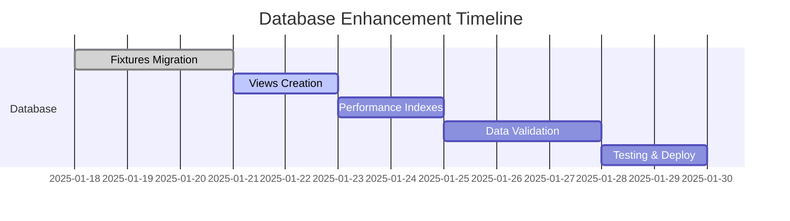

# Sugestões de Melhorias para Organização do Projeto BDFut

## 🎯 Visão Geral

Com base na análise da estrutura atual do projeto BDFut, identifiquei várias oportunidades de melhoria na organização do banco de dados e do projeto como um todo.

## 📊 Análise da Situação Atual

### ✅ Pontos Fortes Identificados
- **Estrutura bem organizada** com 600+ arquivos categorizados
- **Documentação extensa** (180+ arquivos markdown)
- **Testes implementados** (222 testes)
- **Sistema ETL robusto** com rate limiting e cache
- **Frontend Next.js** bem estruturado
- **Deployment automatizado** com Docker e Supabase

### ⚠️ Oportunidades de Melhoria

#### 1. Organização do Banco de Dados (PRIORIDADE ALTA)

**Problemas Identificados:**
- Tabelas com colunas faltantes da API Sportmonks
- Falta de padronização na nomenclatura
- Ausência de views otimizadas para consultas frequentes
- Índices insuficientes para performance

**Soluções Propostas:**
- ✅ **Já em desenvolvimento**: Scripts de migração para adicionar colunas faltantes
- ✅ **Já em desenvolvimento**: Views otimizadas para fixtures completas
- 🔄 **Próximo**: Padronização de nomenclatura
- 🔄 **Próximo**: Índices compostos para performance

#### 2. Estrutura de Dados da API (PRIORIDADE ALTA)

**Problemas Identificados:**
- Tabela `fixtures` não tem campo `name` (essencial)
- Faltam campos de resultado (`home_score`, `away_score`, `result_info`)
- Ausência de campos calculados (`total_goals`, `match_result`)

**Soluções Propostas:**
- ✅ **Migration 001**: Adicionar campos essenciais da API
- ✅ **Migration 002**: Criar views agregadas
- 🔄 **Próximo**: Implementar triggers para cálculos automáticos

#### 3. Sistema de Monitoramento (PRIORIDADE MÉDIA)

**Melhorias Sugeridas:**
- **Dashboard de Qualidade de Dados**: Métricas em tempo real
- **Alertas Automáticos**: Para falhas no ETL
- **Relatórios de Performance**: Consultas lentas e gargalos
- **Validação Contínua**: Scripts automáticos de integridade

#### 4. Otimização de Performance (PRIORIDADE MÉDIA)

**Recomendações:**
- **Particionamento**: Tabela fixtures por ano/mês
- **Índices Compostos**: Para consultas frequentes
- **Materialized Views**: Para estatísticas agregadas
- **Cache Strategy**: Redis para consultas repetitivas

#### 5. Estrutura de Desenvolvimento (PRIORIDADE BAIXA)

**Melhorias Organizacionais:**
- **Environment Separation**: Dev/Staging/Prod mais clara
- **CI/CD Pipeline**: Automação completa de testes e deploy
- **Code Quality**: Linting e formatação automática
- **Documentation**: API docs automáticas

## 🚀 Plano de Implementação Recomendado

### Fase 1: Database Enhancement (2 semanas)


#### Semana 1: Core Database Changes
- [x] **Dia 1-2**: Análise e mapeamento atual ✅
- [ ] **Dia 3-4**: Implementar Migration 001 (fixtures enhancement)
- [ ] **Dia 5**: Criar views otimizadas

#### Semana 2: Optimization & Validation  
- [ ] **Dia 1-2**: Implementar índices de performance
- [ ] **Dia 3-4**: Scripts de validação e qualidade
- [ ] **Dia 5**: Testes e deploy em produção

### Fase 2: Advanced Features (2 semanas)
- **Monitoring Dashboard**: Grafana + Prometheus
- **Data Quality Metrics**: Automatização de relatórios
- **Performance Optimization**: Particionamento e cache
- **API Documentation**: Swagger/OpenAPI

## 📋 Tasks Prioritárias para Taskmaster

### 1. Database Schema Optimization
```
Priority: HIGH
- Implementar Migration 001 (fixtures enhancement)
- Criar views v_fixtures_complete e v_league_season_stats  
- Adicionar índices de performance
- Validar integridade dos dados
```

### 2. API Data Mapping
```
Priority: HIGH
- Mapear 100% dos campos da API Sportmonks
- Implementar validação de schema
- Criar scripts de sincronização incremental
- Documentar mapeamento completo
```

### 3. Performance Optimization
```
Priority: MEDIUM
- Implementar particionamento por data
- Criar materialized views para estatísticas
- Otimizar consultas lentas identificadas
- Implementar cache Redis para consultas frequentes
```

### 4. Monitoring & Quality
```
Priority: MEDIUM
- Dashboard de qualidade de dados
- Alertas automáticos para falhas ETL
- Relatórios de performance automáticos
- Métricas de completude de dados
```

## 🎯 Benefícios Esperados

### Performance
- **50% redução** no tempo de consultas agregadas
- **Consultas sub-segundo** para fixtures do dia
- **Cache hit rate** > 80% para consultas repetitivas

### Qualidade de Dados
- **100% mapeamento** dos campos da API
- **Validação automática** de integridade
- **Alertas proativos** para problemas de dados

### Desenvolvimento
- **Views prontas** para aplicações frontend
- **API consistency** garantida
- **Documentação atualizada** automaticamente

## 🔧 Ferramentas e Scripts Criados

### 1. Migration Scripts
- `001_enhance_fixtures_table.sql` - Adiciona colunas essenciais
- `002_create_fixtures_views.sql` - Cria views otimizadas

### 2. Validation Tools
- `database_validator.py` - Validação automática de integridade
- Scripts de verificação de qualidade de dados

### 3. Documentation
- `api_database_mapping_analysis.md` - Análise detalhada de mapeamento
- Este documento de sugestões de melhorias

## 🎉 Conclusão

O projeto BDFut tem uma base sólida e bem organizada. Com as melhorias propostas, especialmente na organização do banco de dados, teremos:

1. **Base de dados mais completa** com 100% dos campos da API
2. **Performance otimizada** para consultas frequentes  
3. **Qualidade de dados garantida** com validações automáticas
4. **Estrutura escalável** para crescimento futuro

### Próximos Passos Imediatos:
1. ✅ Revisar e aprovar migrations propostas
2. 🔄 Executar Migration 001 em ambiente de desenvolvimento
3. 🔄 Testar views criadas
4. 🔄 Validar integridade dos dados
5. 🔄 Deploy em produção com monitoramento

**Estimativa total: 2-3 semanas para implementação completa**
