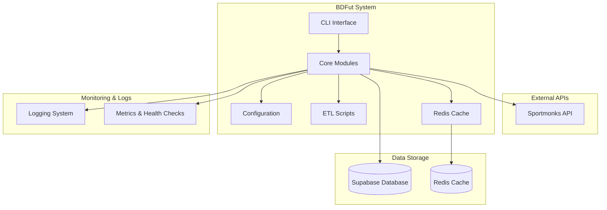
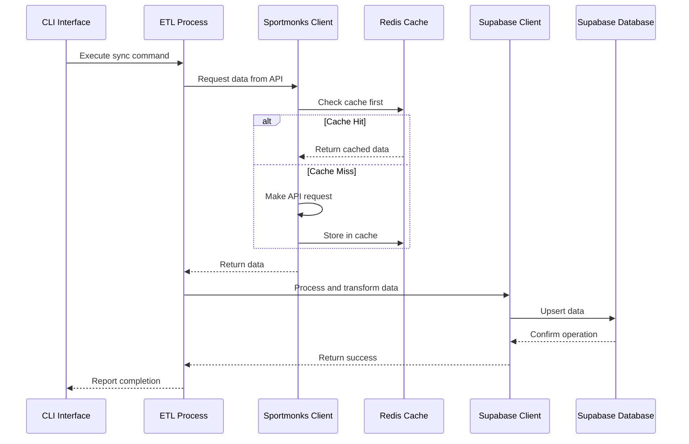

# Arquitetura do Sistema BDFut 🏗️

## Visão Geral

O BDFut é um sistema profissional de ETL (Extract, Transform, Load) para sincronização de dados de futebol da API Sportmonks com banco de dados Supabase. O sistema foi projetado com arquitetura modular, alta disponibilidade e escalabilidade.

## Diagrama de Arquitetura Geral

## Componentes Principais

### 1. Core Modules (`bdfut/core/`)

#### ETL Process (`etl_process.py`)
- **Responsabilidade**: Coordena todo o processo de ETL
- **Funcionalidades**:
  - Sincronização de dados base (countries, states, types)
  - Sincronização de ligas e temporadas
  - Sincronização de times por temporada
  - Sincronização de partidas por intervalo de datas
  - Sincronização incremental
  - Sincronização completa

#### Sportmonks Client (`sportmonks_client.py`)
- **Responsabilidade**: Interface com a API Sportmonks
- **Funcionalidades**:
  - Rate limiting inteligente
  - Sistema de cache com Redis
  - Retry automático com backoff exponencial
  - Tratamento de erros robusto
  - Suporte a múltiplos endpoints

#### Supabase Client (`supabase_client.py`)
- **Responsabilidade**: Interface com banco de dados Supabase
- **Funcionalidades**:
  - Operações CRUD para todas as entidades
  - Upsert inteligente (insert ou update)
  - Tratamento de relacionamentos
  - Suporte a schemas múltiplos

#### ETL Metadata (`etl_metadata.py`)
- **Responsabilidade**: Gerenciamento de metadados do ETL
- **Funcionalidades**:
  - Controle de jobs ETL
  - Logging estruturado
  - Checkpoints de progresso
  - Métricas de performance

#### Redis Cache (`redis_cache.py`)
- **Responsabilidade**: Sistema de cache inteligente
- **Funcionalidades**:
  - Cache com TTL configurável
  - Fallback automático
  - Invalidação inteligente
  - Métricas de hit/miss

### 2. Configuration (`bdfut/config/`)

#### Config (`config.py`)
- **Responsabilidade**: Configuração centralizada
- **Funcionalidades**:
  - Validação de configurações
  - Suporte a múltiplos ambientes
  - Gerenciamento de secrets
  - Configurações de rate limiting

#### Settings (`settings.py`)
- **Responsabilidade**: Configurações específicas do ambiente
- **Funcionalidades**:
  - Configurações de desenvolvimento
  - Configurações de produção
  - Validação de dependências

### 3. Scripts Organizados (`bdfut/scripts/`)

#### ETL Scripts (`etl/`)
- Scripts especializados para diferentes tipos de sincronização
- Organizados por categoria e função
- Suporte a execução individual ou em batch

#### Sync Scripts (`sync/`)
- Scripts de sincronização específicos por liga
- Sincronização incremental
- Sincronização completa

#### Maintenance Scripts (`maintenance/`)
- Scripts de manutenção do banco
- Limpeza de dados
- Otimização de performance

#### Testing Scripts (`testing/`)
- Scripts de teste de conectividade
- Validação de dados
- Testes de performance

#### Utils Scripts (`utils/`)
- Utilitários diversos
- Ferramentas de análise
- Conversores de dados

### 4. CLI Interface (`bdfut/cli.py`)

#### Comandos Principais
- `show-config`: Exibe configuração atual
- `test-connection`: Testa conectividade
- `sync-base`: Sincronização de dados base
- `sync-leagues`: Sincronização de ligas específicas
- `full-sync`: Sincronização completa
- `incremental`: Sincronização incremental

## Fluxo de Dados ETL

## Padrões de Design

### 1. Repository Pattern
- Clientes encapsulam acesso a dados externos
- Interface consistente para diferentes fontes de dados

### 2. Strategy Pattern
- Diferentes estratégias de sincronização
- Configurável por tipo de dados

### 3. Observer Pattern
- Sistema de logging e métricas
- Notificações de eventos

### 4. Factory Pattern
- Criação de clientes baseada em configuração
- Instanciação de componentes

## Decisões de Arquitetura

### 1. Modularidade
- **Decisão**: Separar responsabilidades em módulos distintos
- **Justificativa**: Facilita manutenção, teste e extensibilidade
- **Benefícios**: Código mais limpo, reutilização, testabilidade

### 2. Cache Inteligente
- **Decisão**: Implementar cache Redis com fallback
- **Justificativa**: Reduz chamadas à API externa e melhora performance
- **Benefícios**: Menor latência, economia de rate limit, resiliência

### 3. Rate Limiting
- **Decisão**: Implementar controle de rate limiting no cliente
- **Justificativa**: Respeitar limites da API e evitar bloqueios
- **Benefícios**: Operação estável, sem interrupções

### 4. Upsert Operations
- **Decisão**: Usar operações upsert no banco de dados
- **Justificativa**: Evitar duplicatas e permitir atualizações
- **Benefícios**: Integridade dos dados, operações idempotentes

### 5. Metadata Management
- **Decisão**: Sistema de metadados para controle de jobs
- **Justificativa**: Rastreabilidade e controle de execução
- **Benefícios**: Debugging, monitoramento, auditoria

## Escalabilidade

### Horizontal Scaling
- Múltiplas instâncias podem executar diferentes tipos de sincronização
- Cache Redis compartilhado entre instâncias
- Banco de dados Supabase suporta múltiplas conexões

### Vertical Scaling
- Sistema otimizado para uso eficiente de recursos
- Cache reduz carga no banco de dados
- Rate limiting evita sobrecarga da API externa

## Segurança

### 1. Secrets Management
- Configurações sensíveis em variáveis de ambiente
- Validação de configurações na inicialização
- Suporte a múltiplos ambientes

### 2. Data Validation
- Validação de dados na entrada
- Sanitização antes do armazenamento
- Tratamento de erros robusto

### 3. Access Control
- Autenticação via API keys
- Controle de acesso baseado em configuração
- Logs de auditoria para operações

## Monitoramento e Observabilidade

### 1. Logging
- Logs estruturados com níveis configuráveis
- Contexto de execução incluído
- Rotação automática de logs

### 2. Métricas
- Contadores de requests da API
- Taxa de hit/miss do cache
- Tempo de execução de jobs
- Contadores de registros processados

### 3. Health Checks
- Verificação de conectividade com APIs
- Status do cache Redis
- Validação de configurações

## Tecnologias Utilizadas

### Backend
- **Python 3.8+**: Linguagem principal
- **Supabase**: Banco de dados PostgreSQL
- **Redis**: Sistema de cache
- **Requests**: Cliente HTTP
- **Tenacity**: Retry automático

### Ferramentas de Desenvolvimento
- **Pytest**: Framework de testes
- **Black**: Formatação de código
- **Flake8**: Linting
- **MyPy**: Verificação de tipos

### Infraestrutura
- **Docker**: Containerização
- **GitHub Actions**: CI/CD
- **Supabase CLI**: Deploy e migrações

## Próximos Passos

### Melhorias Planejadas
1. **Dashboard Web**: Interface web para monitoramento
2. **API REST**: Exposição de dados via API
3. **Notificações**: Sistema de alertas
4. **Analytics**: Dashboards de métricas
5. **Machine Learning**: Análise preditiva de dados

### Otimizações
1. **Batch Processing**: Processamento em lotes maiores
2. **Parallel Processing**: Execução paralela de jobs
3. **Data Compression**: Compressão de dados em cache
4. **Indexing**: Otimização de índices no banco

---

**Última atualização**: 2025-01-13  
**Versão**: 2.0  
**Responsável**: Technical Writer
